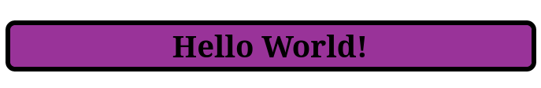

<div align="center">

# `Web Development`

<h3>
  Programme de development web. 
</h3>

<!-- Badges -->


<!-- Demo image -->


</div>

<div align="center">

# `HTML`

</div>

## Qu'est-ce que le HTML ?
- HTML signifie Hyper Text Markup Language.
- Un fichier HTML est un fichier texte simple, parfaitement lisible, respectant un ensemble de convention d'écriture
- HTML est le langage de balisage standard pour la création de pages Web.
- HTML décrit la structure d'une page Web.
- HTML se compose d'une série d'éléments.
- Un fichier HTML (Hyper Text Markup Language) n'est pas compilé (ce n'est pas un programme)

## La base
> Lancez un éditeur de texte et écrivez le code suivant et enregistrez-le sous le nom `index.html` :
```html
<!DOCTYPE html>
<html>
  <head>
    <title>Ma page</title>
  </head>
  <body>
    <h1>Bonjour!</h1>
  </body>
</html>
```
### Explication :
- La déclaration `<!DOCTYPE html>` définit que ce document est un document HTML5.
- L'élément `<html>` est l'élément racine d'une page HTML.
- L'élément `<head>` contient des méta-informations sur la page HTML.
- L'élément `<title>` spécifie un titre pour la page HTML (qui s'affiche dans la barre de titre du navigateur ou dans l'onglet de la page).
- L'élément `<body>` définit le corps du document et est un conteneur pour tous les contenus visibles, tels que les titres, les paragraphes, les images, les hyperliens, les tableaux, les listes, etc.
- L'élément `<h1>` définit un grand titre.

## Titres
> Les titres HTML sont définis avec les balises `<h1>` à `<h6>` :
```html
<h1>Titre 1</h1>
<h2>Titre 2</h2>
<h3>Titre 3</h3>
```

## Paragraphes
> Les paragraphes HTML sont définis avec la balise `<p>` :
```html
<p>Ceci est un paragraphe</p>
```

## Liens
> Les liens HTML sont définis avec la balise `<a>` :
```html
<a href="https://github.com/nemo256/webdev">Development Web</a>
```
- La destination du lien est spécifiée dans l'attribut `href`.
- Les attributs sont utilisés pour fournir des informations supplémentaires sur les éléments HTML.

## Images
> Les images HTML sont définies avec la balise `` :
```html

```
- Le fichier source `src`, le texte alternatif si l'image n'est pas trouvée `alt`, la largeur et la hauteur sont fournis sous forme d'attributs `width` et `height` respectivement.


## L'attribut `style`
> L'attribut `style` est utilisé pour ajouter des styles à un élément, tels que la couleur, la police, la taille, etc.
```html
<h2 style="background-color: #993399; border: 4px solid black; border-radius: 8px; text-align: center;">Hello World!</h2>
```


## Éléments de mise en forme HTML
> Les éléments de mise en forme affichent des types de texte particuliers :

| Balise | Description |
| ---------- | ------------------------------------- |
| `<b>` | Définit le texte en gras |
| `<strong>` | Définit le texte important |
| `<i>` | Définit le texte en italique |
| `<em>` | Définit le texte mis en évidence |
| `<mark>` | Définit le texte marqué |
| `<small>` | Définit un texte plus petit |
| `<del>` | Définit le texte supprimé |
| `<ins>` | Définit le texte inséré |
| `<sub>` | Définit le texte en indice |
| `<sup>` | Définit le texte en exposant |
