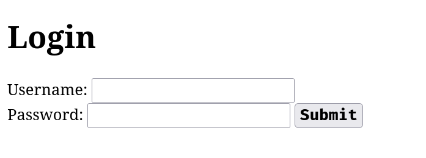

<div align="center">

# `Web Development`

<h3>
  Programme de development web. 
</h3>

<!-- Badges -->


<!-- Demo image -->


</div>

<div align="center">

# `HTML`

</div>

## Qu'est-ce que le HTML ?
- HTML signifie Hypertext Markup Language.
- Un fichier HTML est un fichier texte simple, parfaitement lisible, respectant un ensemble de convention d'écriture.
- HTML est le langage de balisage standard pour la création de pages Web.
- HTML décrit la structure d'une page Web.
- HTML se compose d'une série d'éléments.
- Un fichier HTML (Hyper Text Markup Language) n'est pas compilé (ce n'est pas un programme)

## La base
> Lancez un éditeur de texte et écrivez le code suivant et enregistrez-le sous le nom `index.html` :
```html
<!DOCTYPE html>
<html>
  <head>
    <title>Ma page</title>
  </head>
  <body>
    <h1>Bonjour!</h1>
  </body>
</html>
```
### Explication :
- La déclaration `<!DOCTYPE html>` définit que ce document est un document HTML.
- L'élément `<html>` est l'élément racine d'une page HTML.
- L'élément `<head>` contient des méta-informations sur la page HTML.
- L'élément `<title>` spécifie un titre pour la page HTML (qui s'affiche dans la barre de titre du navigateur ou dans l'onglet de la page).
- L'élément `<body>` définit le corps du document et est un conteneur pour tous les contenus visibles, tels que les titres, les paragraphes, les images, les hyperliens, les tableaux, les listes, etc.
- L'élément `<h1>` définit un grand titre.

## Titres
> Les titres HTML sont définis avec les balises `<h1>` à `<h6>`, exemple :
```html
<h1>Titre 1</h1>
<h2>Titre 2</h2>
<h3>Titre 3</h3>
```

## Paragraphes
> Les paragraphes HTML sont définis avec la balise `<p>`, exemple :
```html
<p>Ceci est un paragraphe</p>
```

## Liens
> Les liens HTML sont définis avec la balise `<a>`, exemple :
```html
<a href="https://github.com/nemo256/webdev">Development Web</a>
```
- La destination du lien est spécifiée dans l'attribut `href`.
- Les attributs sont utilisés pour fournir des informations supplémentaires sur les éléments HTML.

## Images
> Les images HTML sont définies avec la balise ``, exemple :
```html

```
- Le fichier source `src`, le texte alternatif si l'image n'est pas trouvée `alt`, la largeur et la hauteur sont fournis sous forme d'attributs `width` et `height` respectivement.


## L'attribut `style`
> L'attribut `style` est utilisé pour ajouter des styles à un élément, tels que la couleur, la police, la taille, etc... exemple :
```html
<h2 style="background-color: #993399; border: 4px solid black; border-radius: 8px; text-align: center;">Hello World!</h2>
```


## Éléments de mise en forme
> Les éléments de mise en forme affichent des types de texte particuliers, exemple :

| Balise | Description |
| ---------- | ------------------------------------- |
| `<b>` | Définit le texte en gras |
| `<strong>` | Définit le texte important |
| `<i>` | Définit le texte en italique |
| `<em>` | Définit le texte mis en évidence |
| `<mark>` | Définit le texte marqué |
| `<small>` | Définit un texte plus petit |
| `<del>` | Définit le texte supprimé |
| `<ins>` | Définit le texte inséré |
| `<sub>` | Définit le texte en indice |
| `<sup>` | Définit le texte en exposant |

## Commentaires
> Vous pouvez ajouter des commentaires en utilisant la syntaxe suivante, exemple :
```html
<!-- Ceci est un commentaire --> 
```
> Les commentaires peuvent être utilisés pour masquer du contenu :
```html
<!-- <p>Ceci est un paragraphe masqué</p> -->
```
> Vous pouvez également masquer plus d'une ligne :
```html
<!--
<p>Tout ce qui se trouve entre le (<!--) et le (-->) sera caché.</p>

-->
```

## Tableaux
> Un tableau en HTML se compose de cellules de tableau à l'intérieur de lignes et de colonnes, exemple :
```html
<table>
  <tr>
    <th>Module</th>
    <th>Coefficient</th>
    <th>Moyenne</th>
  </tr>
  <tr>
    <td>Anglais</td>
    <td>2</td>
    <td>18</td>
  </tr>
  <tr>
    <td>Development Web</td>
    <td>3</td>
    <td>17</td>
  </tr>
</table>
```

| Module | Coefficient | Moyenne |
| --------------- | ------ | ------ |
| Anglais | 2 | 18 |
| Development Web | 3 | 17 |

- Chaque cellule du tableau est définie par une balise `<td>` et une balise `</td>`.
- Tout ce qui se trouve entre `<td>` et `</td>` est le contenu de la cellule du tableau.
- Chaque ligne du tableau commence par une balise `<tr>` et se termine par une balise `</tr>`.
- Parfois, vos cellules sont des cellules d'en-tête. Dans ce cas, utilisez la balise `<th>` au lieu de la balise `<td>`.

## Listes
### Liste non ordonnée
- Une liste non ordonnée commence par la balise `<ul>` (unordered list)
- Chaque élément de la liste commence par la balise `<li>` (list item).
```html
<ul>
  <li>Alice</li>
  <li>Gabriel</li>
  <li>Louis</li>
  <li>Mia</li>
</ul>
```
### Liste ordonnée
- Une liste ordonnée commence par la balise `<ol>` (ordered list)
- Chaque élément de la liste commence par la balise `<li>` (list item).
```html
<ol>
  <li>A</li>
  <li>B</li>
  <li>C</li>
  <li>D</li>
</ol>
```

## Les balises `class` et `id`
- En HTML, les balises ID et class sont utilisées pour attribuer un identifiant spécifique ou un identifiant de groupe à un élément HTML, vous permettant de les cibler à l'aide de CSS ou de JavaScript.

- La principale différence entre les balises ID et class est qu'un ID doit être unique dans un document HTML, tandis qu'une classe peut être utilisée pour identifier plusieurs éléments.
- Utilisation :
```html
<h1 class="mon_titre">Bonjour (class)</h1>
<h1 id="mon_titre">Bonjour (id)</h1>
```
- Nous pouvons sélectionner l'élément est css en utilisant :
```css
<!-- l'attribut <style> est pour definit un style personnalisé -->
<style>
.mon_titre {
  background-color: green;
}

#mon_titre {
  background-color: blue;
}
</style>
```

## Formulaires
> Un formulaire HTML est utilisé pour collecter les entrées des utilisateurs. L'entrée utilisateur est envoyée à un serveur pour traitement, Exemple :
```html
<form>
  <label for="utilisateur">Utilisateur :</label>
  <input type="text" required>
  <br>
  <label for="password">Mot de passe :</label>
  <input type="password" required>
  <br>
  <input type="submit" value="Connexion">
</form>
```


### L'élément `<input>`
- L'élément HTML `<input>` est l'élément de formulaire le plus utilisé.
- Un élément `<input>` peut être affiché de plusieurs façons, selon l'attribut `type`.
- Voici quelques exemples :

| Type | Description |
| ----------------------- | ------------------------------ |
| `<input type="text">` | Affiche un champ de saisie de texte sur une seule ligne |
| `<input type="email">` | Affiche un champ de saisie d'email |
| `<input type="radio">` | Affiche un bouton radio (pour sélectionner l'un des nombreux choix) |
| `<input type="checkbox">` | Affiche une case à cocher (pour sélectionner zéro ou plusieurs choix) |
| `<input type="submit">` | Affiche un bouton de soumission (pour soumettre le formulaire) |
| `<input type="button">` | Affiche un bouton cliquable |

<div align="center">

# `CSS`

</div>

## Qu'est-ce que le CSS ?
- CSS signifie Cascading Style Sheets.
- CSS est utilisé pour définir les styles de vos pages Web, y compris la conception, la mise en page et les variations d'affichage pour différents appareils et tailles d'écran.
- CSS décrit comment les éléments HTML doivent être affichés à l'écran, sur papier ou sur d'autres supports.
- CSS économise beaucoup de travail. Il peut contrôler la mise en page de plusieurs pages Web à la fois.
- Les feuilles de style externes sont stockées dans des fichiers CSS.

## Démonstration CSS
### Une page login sans CSS :
```html
<!DOCTYPE html>
<html>
  <head>
    <title>Login Page</title>
  </head>
  <body>
    <div id="login-container">
      <h1>Login</h1>
      <form>
        <label for="username">Username:</label>
        <input type="text" id="username" name="username" required>
        <br>

        <label for="password">Password:</label>
        <input type="password" id="password" name="password" required>
        <button type="submit">Submit</button>
      </form>
    </div>
  </body>
</html>
```



### Et maintenant, nous allons ajouter un peu de style, vous pouvez voir la différence :
```html
<!DOCTYPE html>
<html>
  <head>
    <title>Login Page</title>
    <style>
      body {
        background-color: #f2f2f2;
        font-family: Arial, sans-serif;
      }

      #login-container {
        width: 320px;
        margin: 0 auto;
        background-color: #ffffff;
        box-shadow: 0px 0px 10px 8px rgba(0, 0, 0, 0.2);
        border-radius: 10px;
        padding: 24px;
      }

      h1 {
        text-align: center;
      }

      label {
        display: block;
        margin-bottom: 10px;
      }

      input[type="text"],
      input[type="password"] {
        width: 100%;
        padding: 8px 0px;
        border: 2px solid;
        border-radius: 5px;
        margin-bottom: 20px;
      }

      button[type="submit"] {
        background-color: #4CAF50;
        width: 100%;
        color: #ffffff;
        padding: 10px 20px;
        border: none;
        border-radius: 5px;
        cursor: pointer;
      }

      button[type="submit"]:hover {
        background-color: #3e8e41;
      }
    </style>
  </head>
  <body>
    <div id="login-container">
      <h1>Login</h1>
      <form>
        <label for="username">Username:</label>
        <input type="text" id="username" name="username" required>
        <br>

        <label for="password">Password:</label>
        <input type="password" id="password" name="password" required>

        <button type="submit">Submit</button>
      </form>
    </div>
  </body>
</html>
```


## Syntaxe CSS


> Exemple :
```html
<h1>Bonjour!</h1>

<style>
h1 {
  color: blue;
  font-style: italic;
}
</style>
```
> Explication de l'exemple :
- `h1` est un sélecteur en CSS (il pointe vers l'élément HTML que vous souhaitez styliser : `<h1>`).
- `color` est une propriété et `blue` est sa valeur.
- `font-style` est une propriété et `italic` est sa valeur.


## Liste des propriétés CSS les plus communes

| Propriété CSS | Exemple | Description |
| --- | --- | --- |
| `color` | `color: red;` | Définit la couleur du texte |
| `font-size` | `font-size: 20px;` | Définit la taille de police |
| `font-family` | `font-family: Arial, sans-serif;` | Définit la police utilisée |
| `text-align` | `text-align: center;` | Définit l'alignement horizontal du texte |
| `background-color` | `background-color: #FFFFFF;` | Définit la couleur d'arrière-plan |
| `border` | `border: 1px solid black;` | Définit une bordure autour d'un élément |
| `padding` | `padding: 10px;` | Définit l'espace intérieur entre le contenu et la bordure |
| `margin` | `margin: 20px;` | Définit l'espace extérieur entre l'élément et les éléments adjacents |
| `display` | `display: block;` | Définit le type d'affichage de l'élément |
| `float` | `float: left;` | Définit le flottement de l'élément |
| `width` | `width: 50%;` | Définit la largeur de l'élément |
| `height` | `height: 200px;` | Définit la hauteur de l'élément |
| `text-decoration` | `text-decoration: underline;` | Définit la décoration du texte (comme souligner) |
| `text-transform` | `text-transform: uppercase;` | Définit la transformation du texte (majuscule, minuscule, capitale, etc.) |
| `line-height` | `line-height: 1.5;` | Définit la hauteur de ligne d'un élément |
| `font-weight` | `font-weight: bold;` | Définit la graisse de la police (gras ou normal) |
| `opacity` | `opacity: 0.5;` | Définit l'opacité d'un élément (entre 0 et 1) |
| `background-image` | `background-image: url("image.jpg");` | Définit l'image d'arrière-plan |
| `background-size` | `background-size: cover;` | Définit la taille de l'image d'arrière-plan |
| `box-shadow` | `box-shadow: 2px 2px 4px #000000;` | Ajoute une ombre à un élément |
| `text-shadow` | `text-shadow: 1px 1px 2px #000000;` | Ajoute une ombre au texte |
| `border-radius` | `border-radius: 10px;` | Définit le rayon des coins d'une bordure |
| `transition` | `transition: all 0.3s ease-in-out;` | Définit la transition entre deux états d'un élément |
| `position` | `position: absolute;` | Définit la position d'un élément par rapport à son conteneur |
| `z-index` | `z-index: 1;` | Définit l'ordre de superposition d'un élément |
